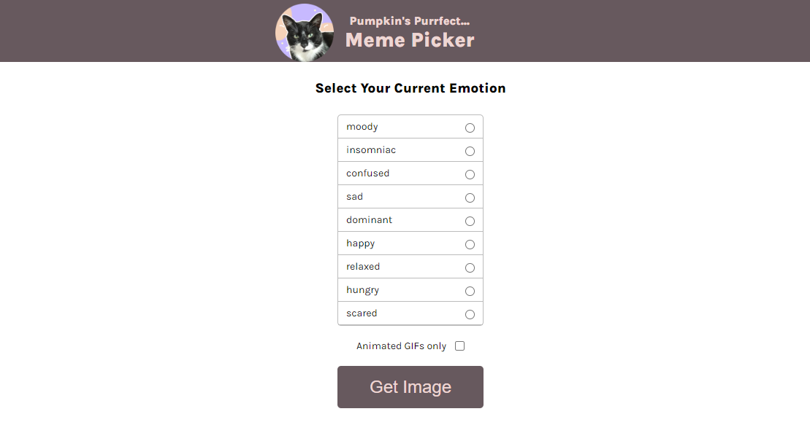
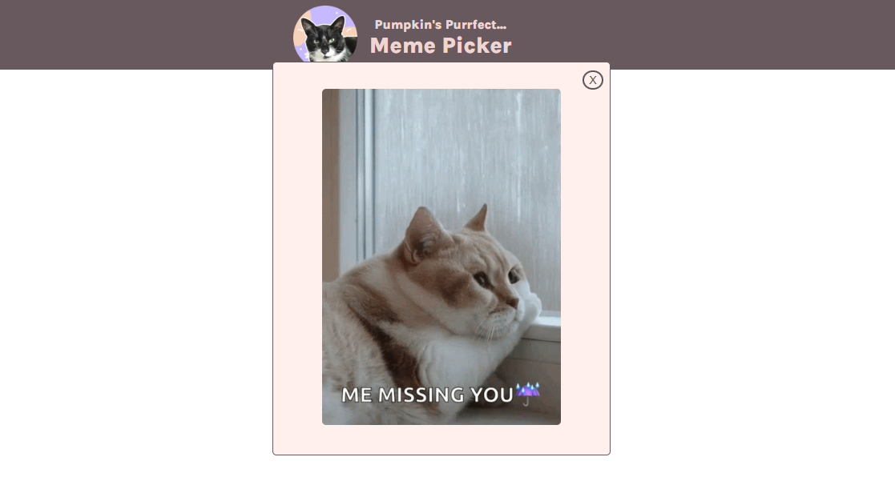

# Cat Meme Generator
This is a web application that generates random cat memes based on the user's selected emotion. Users can choose from a range of emotions, such as happy, sad, moody, etc., and the application will display a cat meme that matches that emotion.

## Features
- User can select an emotion from a list of options
- User can choose to display only GIFs or both GIFs and images
- Application displays a random cat meme that matches the user's selected emotion
## Technologies Used
- HTML
- CSS
- JavaScript

## Screenshot

## Installation
1. Clone the repository: git clone https://github.com/Dachi-Papashvili88/pumpkin-meme-picker
2. Open the index.html file in a web browser
## Usage
1. Select an emotion from the list of options
1. Choose to display only GIFs or both GIFs and images
3. Click the "Get Image" button to display a random cat meme that matches the selected emotion
Credits
The cat images and GIFs used in this application were sourced from Unsplash and GIPHY, respectively.

